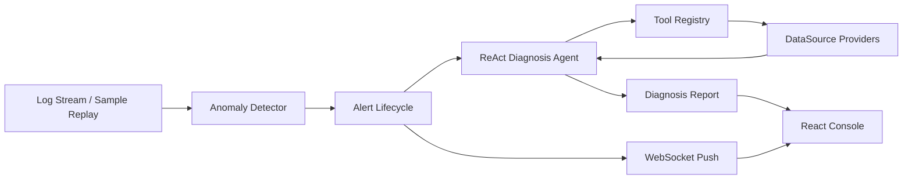

# 架构说明

## 关键设计

- 检测与诊断分离：日志流先经过轻量检测器，异常才触发 Agent。
- 工具与数据源解耦：Agent 只知道工具，工具通过 `DataSource` 查询日志、指标、部署、拓扑和资源。
- 双模式 Agent：有 LLM 配置时走 tool use ReAct；无 Key 时启发式 Agent 保证演示可复现。
- 告警生命周期：firing、acknowledged、investigating、silenced、resolved、escalated。

## 可替换接口

- `ObservabilityStore` 当前提供 sample 数据。
- 生产可替换为 Prometheus、Loki/Elasticsearch、ArgoCD/Jenkins、Kubernetes API。
- 前端通过 REST + WebSocket 展示诊断报告和状态变更。

## 生产边界

- 工具调用需要超时、重试和权限隔离。
- 报告强调 confidence 和 evidence，不把模型输出当成事实。
- 诊断失败不应丢失原始告警。
